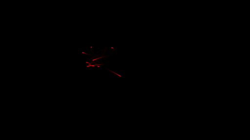

# N-Body Problem

This simple n-body problem simulator was written in a couple of afternoons in the fall of 2024. I wanted to test my open source library [StapleGL](www.github.com/dario-loi/staplegl) by writing some simple graphic application that also performed physics calculations. 

*The gif shows the simulation of 10 bodies with random initial conditions.*

## Features

- **Second order Verlet integration**: the simulation uses the Verlet integration method to solve the equations of motion of the bodies. This method is more stable than the Euler method and is also symplectic.
- **Fixed time step simulation tick-rate**: the simulation runs at an adjustable fixed time step. This means that the simulation will run at the same speed on any machine, regardless of the hardware.
- **Simple trail rendering**: the simulation can render the trajectory of the bodies. This is useful to visualize the orbits of the bodies. The decay rate of the trails can be adjusted by modifying the `nbody_shader.glsl` file.
- **Simple OMP parallelization**: we use OpenMP to parallelize the physics calculations. This is useful to speed up the simulation on multi-core machines, however, the underlying algorithm is still O(n^2), so we can't handle a large number of bodies.